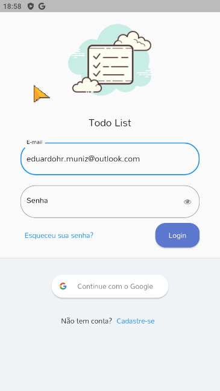

# todo_list_provider
Projeto desenvolvido em flutter para aplicar meus conhecimentos em prática.
foi utilizado: 
- Firebase para efetuar o sistema de autenticação.
- Provider para gerenciamento de estado.
- SqfLite para armazenar os dados no dispositivo.

  

## Getting Started
1. Faça o download do repositório;
2. Abra seu Terminal/Prompt e navegue até o diretório mobx_imc;
3. Rode: code . "Vs code"
4. Abra o arquivo pubspec.yalm e de um pubget;
5. Rode o comando flutter run.

This project is a starting point for a Flutter application.

A few resources to get you started if this is your first Flutter project:

- [Lab: Write your first Flutter app](https://docs.flutter.dev/get-started/codelab)
- [Cookbook: Useful Flutter samples](https://docs.flutter.dev/cookbook)

For help getting started with Flutter development, view the
[online documentation](https://docs.flutter.dev/), which offers tutorials,
samples, guidance on mobile development, and a full API reference.
